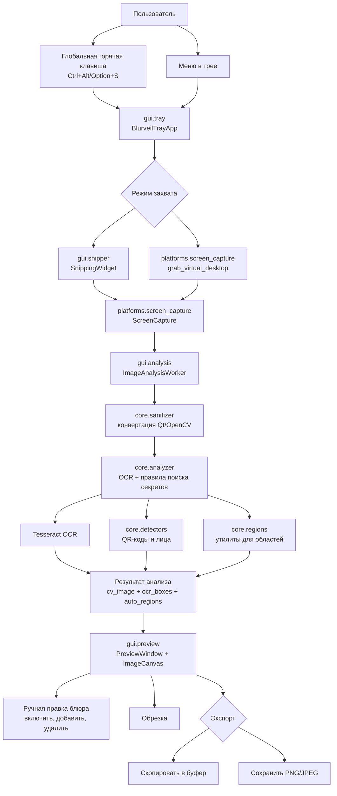
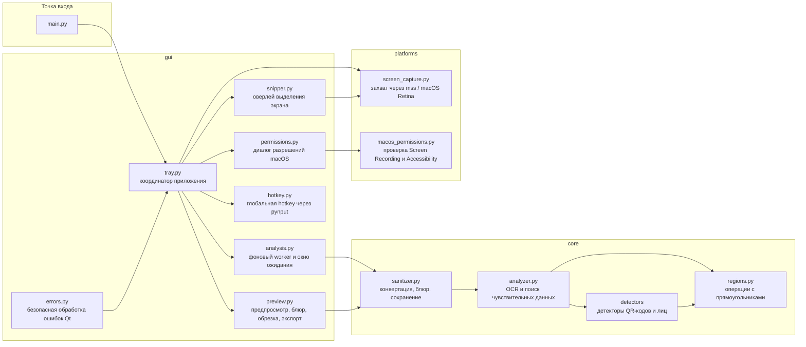

# Архитектура Blurveil

## Карта модулей

## Ответственность частей

| Часть | За что отвечает |
| --- | --- |
| `main.py` | Проверка платформы и запуск Qt-приложения. |
| `gui` | Пользовательский сценарий: трей, hotkey, выделение экрана, фоновая обработка, предпросмотр, экспорт, ошибки. |
| `core` | Анализ и обработка изображения: OCR, поиск чувствительных данных, детекторы объектов, рендер блюра. |
| `platforms` | Системно-зависимый захват экрана и проверка разрешений. |
